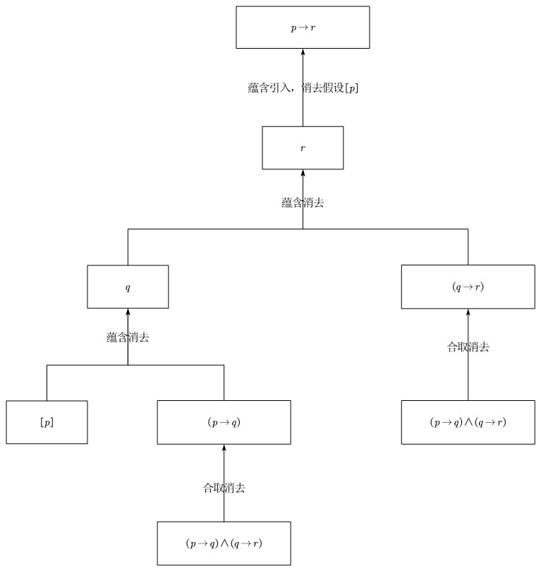

# 自然演绎系统

希尔伯特公理演算系统理论上有无穷多的公理，与一条推理规则（MP 规则），通常使用公理系统编写的证明会非常冗长。逻辑学家根岑（Gerhard Gentzen, 1909-1945）引入与公理系统等价的“自然演绎系统 Natural Deduction System”。自然演绎系统的特点是：没有公理，只有推理规则，而且每个逻辑连接词都有对应的引入规则和消去规则。自然演绎系统的证明结构更接近于数学家日常使用的证明方式，因此在实际应用中更为常用。

<!-- implication_introduction_rule_l_0 -->
> [!Definition]
> **蕴含引入规则 Implication Introduction Rule**：设 $\Gamma$ 是 $\mathcal{L}_0$ 的公式集，$\varphi,\psi$ 是 $\mathcal{L}_0$ 的公式。蕴含引入规则为：
> $$
> \frac{(\Gamma, \varphi) \vdash \psi}{\Gamma \vdash \varphi \to \psi}
> $$

> 蕴含引入规则和公理系统的“演绎定理”密切相关。蕴含引入规则说明，在已知 $\Gamma$ 和假设 $\varphi$ 的前提下，能推出 $\psi$，那么解除假设 $\varphi$，$\Gamma$ 能推出 $\varphi\to\psi$

<!-- implication_elimination_rule_l_0 -->
> [!Definition]
> **蕴含消去规则 Implication Elimination Rule**：设 $\Gamma$ 是 $\mathcal{L}_0$ 的公式集，$\varphi,\psi$ 是 $\mathcal{L}_0$ 的公式。蕴含消去规则为：
> $$
> \frac{\Gamma \vdash \varphi \qquad \Gamma \vdash \varphi \to \psi}{\Gamma \vdash \psi}
> $$

> 蕴含消去规则与公理系统的 “MP 规则”密切相关。蕴含消去规则说明，在已知 $\Gamma$ 的前提下，能推出 $\varphi$ 和 $\varphi\to\psi$，那么 $\Gamma$ 能推出 $\psi$。

<!-- negation_introduction_rule_l_0 -->
> [!Definition]
> **否定引入规则 Negation Introduction Rule**：设 $\Gamma$ 是 $\mathcal{L}_0$ 的公式集，$\varphi$ 是 $\mathcal{L}_0$ 的公式。否定引入规则为：
> $$
> \frac{(\Gamma, \varphi) \vdash \bot}{\Gamma \vdash \neg \varphi}
> $$

> 其中 $(\Gamma, \varphi) \vdash \bot$ 表示，在公式集 $\Gamma$ 和假设 $\varphi$ 的前提下，推出矛盾。

> 否定引入规则说明，在已知 $\Gamma$ 和 假设 $\varphi$ 的前提下，能推出矛盾，那么解除假设 $\varphi$，$\Gamma$ 能推出 $\neg \varphi$。如果将 $\neg \varphi$ 看成 $\varphi \to \bot$，那么否定引入规则就是一种特殊的蕴含引入规则。

<!-- negation_elimination_rule_l_0 -->
> [!Definition]
> **否定消去规则 Negation Elimination Rule**：设 $\Gamma$ 是 $\mathcal{L}_0$ 的公式集，$\varphi$ 是 $\mathcal{L}_0$ 的公式。否定消去规则为：
> $$
> \frac{\Gamma \vdash \varphi \qquad \Gamma \vdash \neg \varphi}{\Gamma \vdash \bot}
> $$

> 否定消去规则说明，在已知 $\Gamma$ 的前提下，能推出 $\varphi$ 和 $\neg \varphi$，那么 $\Gamma$ 推出矛盾。如果将 $\neg \varphi$ 看成 $\varphi \to \bot$，那么否定消去规则就是一种特殊的蕴含消去规则。

<!-- conjunction_introduction_rule_l_0 -->
> [!Definition]
> **合取引入规则 Conjunction Introduction Rule**：设 $\Gamma$ 是 $\mathcal{L}_0$ 的公式集，$\varphi,\psi$ 是 $\mathcal{L}_0$ 的公式。合取引入规则为：
> $$
> \frac{\Gamma \vdash \varphi \qquad \Gamma \vdash \psi}{\Gamma \vdash \varphi \wedge \psi}
> $$

> 合取引入规则说明，在已知 $\Gamma$ 的前提下，能推出 $\varphi$ 和 $\psi$，那么 $\Gamma$ 能推出 $\varphi\wedge\psi$。

<!-- conjunction_elimination_rule_l_0 -->
> [!Definition]
> **合取消去规则 Conjunction Elimination Rule**：设 $\Gamma$ 是 $\mathcal{L}_0$ 的公式集，$\varphi,\psi$ 是 $\mathcal{L}_0$ 的公式。合取消去规则为：
> $$
> \frac{\Gamma \vdash \varphi \wedge \psi}{\Gamma \vdash \varphi} \qquad
> \frac{\Gamma \vdash \varphi \wedge \psi}{\Gamma \vdash \psi}
> $$

> 合取消去规则说明，在已知 $\Gamma$ 的前提下，能推出 $\varphi \wedge \psi$，那么 $\Gamma$ 能分别推出 $\varphi$ 和 $\psi$。

<!-- disjunction_introduction_rule_l_0 -->
> [!Definition]
> **析取引入规则 Disjunction Introduction Rule**：设 $\Gamma$ 是 $\mathcal{L}_0$ 的公式集，$\varphi,\psi$ 是 $\mathcal{L}_0$ 的公式。析取引入规则为：
> $$
> \frac{\Gamma \vdash \varphi}{\Gamma \vdash \varphi \vee \psi} \qquad
> \frac{\Gamma \vdash \psi}{\Gamma \vdash \varphi \vee \psi}
> $$

> 析取引入规则说明，在已知 $\Gamma$ 的前提下，能推出 $\varphi$，那么 $\Gamma$ 能推出 $\varphi \vee \psi$；同样的，如果 $\Gamma$ 能推出 $\psi$，那么 $\Gamma$ 能推出 $\varphi \vee \psi$。

<!-- disjunction_elimination_rule_l_0 -->
> [!Definition]
> **析取消去规则 Disjunction Elimination Rule**：设 $\Gamma$ 是 $\mathcal{L}_0$ 的公式集，$\varphi,\psi,\theta$ 是 $\mathcal{L}_0$ 的公式。析取消去规则为：
> $$
> \frac{\Gamma \vdash \varphi \vee \psi \qquad (\Gamma, \varphi) \vdash \theta \qquad (\Gamma,\psi) \vdash \theta}{\Gamma \vdash \theta}
> $$

> 析取消去规则说明，在已知 $\Gamma$ 的前提下，能推出 $\varphi \vee \psi$，又能在假设 $\varphi$ 的前提下推出 $\theta$，在假设 $\psi$ 的前提下也能推出 $\theta$，那么 $\Gamma$ 能推出 $\theta$。

<!-- biconditional_introduction_rule_l_0 -->
> [!Definition]
> **双条件引入规则 Biconditional Introduction Rule**：设 $\Gamma$ 是 $\mathcal{L}_0$ 的公式集，$\varphi,\psi$ 是 $\mathcal{L}_0$ 的公式。双条件引入规则为：
> $$
> \frac{\Gamma \vdash \varphi \to \psi \qquad \Gamma \vdash \psi \to \varphi}{\Gamma \vdash \varphi \leftrightarrow \psi}
> $$

> 双条件引入规则说明，在已知 $\Gamma$ 的前提下，能推出 $\varphi \to \psi$ 和 $\psi \to \varphi$，那么 $\Gamma$ 能推出 $\varphi \leftrightarrow \psi$。

<!-- biconditional_elimination_rule_l_0 -->
> [!Definition]
> **双条件消去规则 Biconditional Elimination Rule**：设 $\Gamma$ 是 $\mathcal{L}_0$ 的公式集，$\varphi,\psi$ 是 $\mathcal{L}_0$ 的公式。双条件消去规则为：
> $$
> \frac{\Gamma \vdash \varphi \leftrightarrow \psi}{\Gamma \vdash \varphi \to \psi} \qquad
> \frac{\Gamma \vdash \varphi \leftrightarrow \psi}{\Gamma \vdash \psi \to \varphi}
> $$

> 双条件消去规则说明，在已知 $\Gamma$ 的前提下，能推出 $\varphi \leftrightarrow \psi$，那么 $\Gamma$ 能分别推出 $\varphi \to \psi$ 和 $\psi \to \varphi$。

<!-- natural_deduction_formal_proof_l_0 -->
> [!Definition]
> **自然演绎系统的形式证明**：设 $\Gamma$ 是 $\mathcal{L}_0$ 的一个公式集，$\varphi$ 是 $\mathcal{L}_0$ 的一个公式。如果存在一颗有限的树，满足以下条件：
> 1. 根节点是 $\varphi$
> 2. 每个叶节点是 $\Gamma$ 中的一个公式，或者是一个假设
> 3. 每个非叶节点都是由其子节点通过自然演绎系统的推理规则得到的
> 
> 那么，称 $\Gamma$ 能形式证明 $\varphi$，记为 $\Gamma \vdash \varphi$。

> [!Example]+
> **假言三段论**：已知 $\Gamma = \{(p \to q) \wedge (q \to r)\}$，证明 $p\to r$
> 
> 1. $(p \to q) \wedge (q \to r)$ （前提）
> 2. $p \to q$ （由 1 合取消去）
> 3. $q \to r$ （由 1 合取消去）
> 4. $[p]$ （假设）
> 5. $q$ （由 2 和 4 蕴含消去）
> 6. $r$ （由 3 和 5 蕴含消去）
> 7. $p \to r$ （由 4-6 蕴含引入，消去假设 $[p]$）
>
> 最终得到：
> $$
> (p \to q) \wedge (q \to r) \vdash p\to r
> $$
<!-- >
> 写成一个树形结构：
> $$
> \frac{\frac{\frac{\frac{\Gamma\vdash (p \to q) \wedge (q \to r)}{p \to q\quad [p]}}{q} \frac{\Gamma\vdash(p \to q) \wedge (q \to r)}{q \to r}}{r}}{p \to r}
> $$ -->

**经典命题逻辑的自然演绎系统**：上述推理规则构成了直觉主义命题逻辑的自然演绎系统。而经典命题逻辑接受“排中律”，还需要添加以下三条等价的推理规则中任意一个。

<!-- double_negation_elimination_rule_l_0 -->
> [!Definition]
> **双重否定消去规则 Double Negation Elimination Rule**：设 $\Gamma$ 是 $\mathcal{L}_0$ 的一个公式集，$\varphi$ 是 $\mathcal{L}_0$ 的一个公式。双重否定消去规则为：
> $$
> \frac{\Gamma \vdash \neg\neg \varphi}{\Gamma \vdash \varphi}
> $$

<!-- excluded_middle_rule_l_0 -->
> [!Definition]
> **排中规则 Rule of Excluded Middle**：设 $\varphi$ 是 $\mathcal{L}_0$ 的一个公式。排中规则为：
> $$
> \frac{}{\vdash \varphi \vee \neg \varphi}
> $$

<!-- reductio_ad_absurdum_rule_l_0 -->
> [!Definition]
> **归谬规则 Rule of Reductio ad Absurdum**：设 $\Gamma$ 是 $\mathcal{L}_0$ 的一个公式集，$\varphi$ 是 $\mathcal{L}_0$ 的一个公式。归谬律为：
> $$
> \frac{(\Gamma,\neg \varphi)\vdash \bot}{\Gamma\vdash \varphi}
> $$

## 与公理系统的关系

自然演绎系统与希尔伯特公理系统是同一套命题逻辑的两种不同表述方式：公理系统“公理多、规则少”，把推理的负担压缩成无穷多条公理模式与唯一的 MP 规则；自然演绎系统“规则多、公理少”，把推理的负担分散到每个逻辑连接词的引入与消去规则上。尽管形式迥异，但两者刻画的可证明关系完全相同。

两套系统的推理规则之间存在自然的对应关系：

| 自然演绎规则 | 公理系统中的对应 |
| --- | --- |
| 蕴含引入规则 | 演绎定理 |
| 蕴含消去规则 | MP 规则 |
| 否定引入规则 | 归谬律 |
| 否定消去规则 | 矛盾的导出 |
| 归谬规则 / 双重否定消去 | 反证法 / 双重否定律 |

- **从公理系统到自然演绎系统**：公理系统的三条公理模式都可以在自然演绎系统中作为内定理推导出来。例如肯定后件模式 $\varphi\to(\psi\to\varphi)$，只需在假设 $\varphi$、$\psi$ 下平凡地得到 $\varphi$，再两次使用蕴含引入规则解除假设即可；而 MP 规则正是蕴含消去规则本身。因此凡是公理系统可证明的，自然演绎系统都可证明。
- **从自然演绎系统到公理系统**：自然演绎系统的每条推理规则都能由公理系统中的定理模拟。蕴含引入规则对应演绎定理，蕴含消去规则对应 MP 规则，否定相关的规则对应归谬律、反证法与双重否定律。因此凡是自然演绎系统可证明的，公理系统都可证明。

<!-- equivalence_of_deduction_systems_l_0 -->
> [!Theorem]
> **演绎系统的等价性 Equivalence of Deduction Systems**：设 $\Gamma$ 是 $\mathcal{L}_0$ 的公式集，$\varphi$ 是 $\mathcal{L}_0$ 的公式。则在希尔伯特公理系统中 $\Gamma \vdash \varphi$ 当且仅当在（经典）自然演绎系统中 $\Gamma \vdash \varphi$。

> 证明思路：必要性方面，将公理系统的每条公理模式实例在自然演绎系统中导出为内定理，并用蕴含消去规则模拟 MP 规则，于是公理系统的任意一条形式证明都可逐行翻译为自然演绎系统的证明。充分性方面，对自然演绎系统证明树的结构作归纳：蕴含引入规则由演绎定理保证，蕴含消去规则由 MP 规则保证，否定与析取等规则分别由归谬律、反证法、双重否定律等公理系统中已证明的定理保证，于是自然演绎系统的任意证明都可翻译为公理系统的证明。

> 等价性定理说明，两套系统证明出的可证明式集合完全相同，因此在讨论命题逻辑的语法性质（如可靠性、完全性）时，可以自由选用其中任意一套系统，而不影响结论。