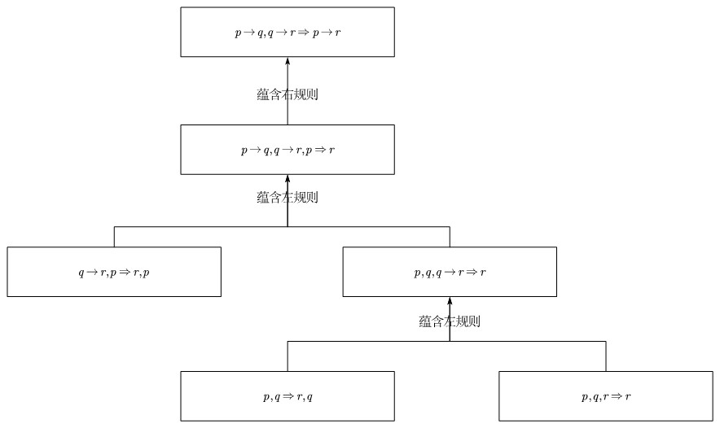

# 相继式演算系统

“相继式演算系统 Sequent Calculus System” 是根岑（Gerhard Gentzen, 1909-1945）引入的另一种演绎系统。相继式演算系统同样没有公理，只有推理规则，但是每个推理规则都是局部的，也即，每条推理规则只涉及一个公式的结构，而不涉及整个证明结构。根岑引入相继式演算，是为了证明“切消定理”，也即切规则可以消去，从而获得一系列重要的结论。

> 下文中的相继式演算系统是经典命题逻辑相继式演算系统，记为 $\mathbf{LK}$，另外还有直觉主义命题逻辑相继式演算系统，记为 $\mathbf{LJ}$。

<!-- sequent_l_0 -->
> [!Definition]
> **相继式 Sequent**：设 $\Gamma$ 和 $\Delta$ 是 $\mathcal{L}_0$ 的有限多重公式集，定义相继式为：
> $$
> \Gamma \Rightarrow \Delta
> $$
> 其中，$\Gamma$ 称为“前件 Antecedent”，$\Delta$ 称为“后件 Succedent”。

> 相继式 $\Gamma \Rightarrow \Delta$ 的含义是：在已知 $\Gamma = \{\varphi_1,\cdots,\varphi_n\}$ 中所有公式都成立的前提下，能推出 $\Delta = \{\psi_1,\cdots,\psi_m\}$ 中至少一个公式成立：
> $$
> \varphi_1 \wedge \cdots \wedge \varphi_n \to \psi_1 \vee \cdots \vee \psi_m
> $$

> 多重集说明集合中可以包含重复的元素。比如，$\Gamma = \{\varphi_1,\varphi_1,\varphi_2\}$ 是一个多重集，其中 $\varphi_1$ 出现了两次，通过“收缩规则”可以“去重”。

> 直觉主义相继式是在经典相继式的基础上引入限制条件，要求后件中最多只有能有一个公式，也即 $\Delta=\{\psi\}$ 或 $\Delta=\varnothing$。

相继式演算系统的推理规则分为两类：结构规则和逻辑规则。结构规则有三条，分别是弱化规则、收缩规则和切规则。

<!-- weakening_rule_l_0 -->
> [!Definition]
> **弱化规则 Weakening Rule**：设 $\Gamma$ 和 $\Delta$ 是 $\mathcal{L}_0$ 的有限多重公式集，$\varphi$ 是 $\mathcal{L}_0$ 的公式。弱化规则为：
> $$
> \frac{\Gamma \Rightarrow \Delta}{\Gamma, \varphi \Rightarrow \Delta} \qquad \frac{\Gamma \Rightarrow \Delta}{\Gamma \Rightarrow \Delta, \varphi}
> $$

<!-- contraction_rule_l_0 -->
> [!Definition]
> **收缩规则 Contraction Rule**：设 $\Gamma$ 和 $\Delta$ 是 $\mathcal{L}_0$ 的有限多重公式集，$\varphi$ 是 $\mathcal{L}_0$ 的公式。收缩规则为：
> $$
> \frac{\Gamma, \varphi, \varphi \Rightarrow \Delta}{\Gamma, \varphi \Rightarrow \Delta} \qquad \frac{\Gamma \Rightarrow \Delta, \varphi, \varphi}{\Gamma \Rightarrow \Delta, \varphi}
> $$

<!-- cut_rule_l_0 -->
> [!Definition]
> **切规则 Cut Rule**：设 $\Gamma$、$\Sigma$ 和 $\Delta$ 是 $\mathcal{L}_0$ 的有限多重公式集，$\varphi$ 是 $\mathcal{L}_0$ 的公式。切规则为：
> $$
> \frac{\Gamma \Rightarrow \Delta, \varphi \qquad \Gamma, \varphi \Rightarrow \Delta}{\Gamma \Rightarrow \Delta}
> $$

> 更一般形式的切规则为：
> $$
> \frac{\Gamma \Rightarrow \Delta, \varphi \qquad \Sigma, \varphi \Rightarrow \Pi}{\Gamma, \Sigma \Rightarrow \Delta, \Pi}
> $$

> 切规则中，$\varphi$ 称为切公式。也称为“引理”，后面切消定理说明，切公式可以从证明中去掉，也即，如果 $\varphi$ 是一个切公式，那么在证明中可以不使用 $\varphi$，而直接从 $\Gamma$ 和 $\Sigma$ 的前提下推出 $\Delta,\Pi$。

逻辑规则与连接词有关，每个连接词都分别有一个左规则和右规则。

<!-- conjunction_left_rule_l_0 -->
> [!Definition]
> **合取左规则 Conjunction Left Rule**：设 $\Gamma$ 和 $\Delta$ 是 $\mathcal{L}_0$ 的有限多重公式集，$\varphi$ 和 $\psi$ 是 $\mathcal{L}_0$ 的公式。合取左规则为：
> $$
> \frac{\Gamma, \varphi, \psi \Rightarrow \Delta}{\Gamma, \varphi \wedge \psi \Rightarrow \Delta}
> $$

<!-- conjunction_right_rule_l_0 -->
> [!Definition]
> **合取右规则 Conjunction Right Rule**：设 $\Gamma$ 和 $\Delta$ 是 $\mathcal{L}_0$ 的有限多重公式集，$\varphi$ 和 $\psi$ 是 $\mathcal{L}_0$ 的公式。合取右规则为：
> $$
> \frac{\Gamma \Rightarrow \Delta, \varphi \qquad \Gamma \Rightarrow \Delta, \psi}{\Gamma \Rightarrow \Delta, \varphi \wedge \psi}
> $$

<!-- disjunction_left_rule_l_0 -->
> [!Definition]
> **析取左规则 Disjunction Left Rule**：设 $\Gamma$ 和 $\Delta$ 是 $\mathcal{L}_0$ 的有限多重公式集，$\varphi$ 和 $\psi$ 是 $\mathcal{L}_0$ 的公式。析取左规则为：
> $$
> \frac{\Gamma, \varphi \Rightarrow \Delta \qquad \Gamma, \psi \Rightarrow \Delta}{\Gamma, \varphi \vee \psi \Rightarrow \Delta}
> $$

<!-- disjunction_right_rule_l_0 -->
> [!Definition]
> **析取右规则 Disjunction Right Rule**：设 $\Gamma$ 和 $\Delta$ 是 $\mathcal{L}_0$ 的有限多重公式集，$\varphi$ 和 $\psi$ 是 $\mathcal{L}_0$ 的公式。析取右规则为：
> $$
> \frac{\Gamma \Rightarrow \Delta, \varphi, \psi}{\Gamma \Rightarrow \Delta, \varphi \vee \psi}
> $$

<!-- implication_left_rule_l_0 -->
> [!Definition]
> **蕴含左规则 Implication Left Rule**：设 $\Gamma$ 和 $\Delta$ 是 $\mathcal{L}_0$ 的有限多重公式集，$\varphi$ 和 $\psi$ 是 $\mathcal{L}_0$ 的公式
> $$
> \frac{\Gamma \Rightarrow \Delta, \varphi \qquad \Gamma, \psi \Rightarrow \Delta}{\Gamma, \varphi \to \psi \Rightarrow \Delta}
> $$

<!-- implication_right_rule_l_0 -->
> [!Definition]
> **蕴含右规则 Implication Right Rule**：设 $\Gamma$ 和 $\Delta$ 是 $\mathcal{L}_0$ 的有限多重公式集，$\varphi$ 和 $\psi$ 是 $\mathcal{L}_0$ 的公式
> $$
> \frac{\Gamma, \varphi \Rightarrow \Delta, \psi}{\Gamma \Rightarrow \Delta, \varphi \to \psi}
> $$

<!-- negation_left_rule_l_0 -->
> [!Definition]
> **否定左规则 Negation Left Rule**：设 $\Gamma$ 和 $\Delta$ 是 $\mathcal{L}_0$ 的有限多重公式集，$\varphi$ 是 $\mathcal{L}_0$ 的公式
> $$
> \frac{\Gamma \Rightarrow \Delta, \varphi}{\Gamma, \neg \varphi \Rightarrow \Delta}
> $$

<!-- negation_right_rule_l_0 -->
> [!Definition]
> **否定右规则 Negation Right Rule**：设 $\Gamma$ 和 $\Delta$ 是 $\mathcal{L}_0$ 的有限多重公式集，$\varphi$ 是 $\mathcal{L}_0$ 的公式
> $$
> \frac{\Gamma, \varphi \Rightarrow \Delta}{\Gamma \Rightarrow \Delta, \neg \varphi}
> $$

<!-- initial_sequent_l_0 -->
> [!Definition]
> **初始相继式 Initial Sequent**：设 $\varphi$ 是 $\mathcal{L}_0$ 的公式，相继式：
> $$
> \varphi \Rightarrow \varphi
> $$
> 称为初始相继式。设 $\Gamma$ 和 $\Delta$ 是 $\mathcal{L}_0$ 的有限多重公式集，通过弱化规则，得到含弱化旁支的初始相继式：
> $$
> \Gamma, \varphi \Rightarrow \Delta, \varphi
> $$

<!-- formal_proof_sequent_calculus_l_0 -->
> [!Definition]
> **相继式演算系统的形式证明**：设 $\Gamma \Rightarrow \Delta$ 是一个相继式，如果存在一个有限的树，满足以下条件：
> 1. 树的每一个节点都是一个相继式
> 2. 根节点是目标相继式 $\Gamma \Rightarrow \Delta$
> 3. 每个叶子节点是初始相继式（含弱化旁支）
> 4. 每个非叶子节点都是由其子节点通过相继式演算系统的推理规则得到的
> 
> 那么称该树为 $\Gamma \Rightarrow \Delta$ 的一个形式证明

> [!Example]+
> 用相继式演算系统证明假言三段论 $p\to q,\, q\to r \Rightarrow p\to r$。
>
> 自根节点（目标相继式）向上逐步应用推理规则，构造形式证明树：
> $$
> \cfrac{
>   \cfrac{
>     q\to r,\, p \Rightarrow r,\, p
>     \qquad
>     \cfrac{
>       p,\, q \Rightarrow r,\, q
>       \qquad
>       p,\, q,\, r \Rightarrow r
>     }{p,\, q,\, q\to r \Rightarrow r}
>   }{p\to q,\, q\to r,\, p \Rightarrow r}
> }{p\to q,\, q\to r \Rightarrow p\to r}
> $$
> 所有叶子节点都是（带旁支的）初始相继式，故该树是 $p\to q,\, q\to r \Rightarrow p\to r$ 的一个形式证明。注意整个证明没有用到切规则。

<!-- internal_theorem_sequent_calculus_l_0 -->
> [!Definition]
> **相继式演算系统的内定理 Internal Theorem**：如果相继式 $\Rightarrow \varphi$ 在 $\mathbf{LK}$ 中可证，那么称 $\varphi$ 是相继式演算系统的一个内定理。

## 切消定理

相继式演算系统中，切规则是唯一一条会在结论中引入“在前提里出现、但在结论里消失”的公式（切公式）的规则。根岑的核心结果表明，这条规则是可以消去的。

<!-- cut_elimination_theorem_l_0 -->
> [!Theorem]
> **切消定理 Cut Elimination Theorem（根岑主定理 Hauptsatz）**：若相继式 $\Gamma \Rightarrow \Delta$ 在 $\mathbf{LK}$ 中可证，则它存在一个不使用切规则的形式证明。

> 证明思路：对切规则作消去归纳。为每个切引入两个度量：切公式的复杂度（秩），即切公式中逻辑连接词的个数；以及切上方两棵子证明的高度之和。考虑一个以切作为最后一步、且两个前提均已无切的证明，按照（切公式复杂度，高度之和）的字典序作归纳：
> 1. 切公式在两个前提中都是主公式：此时切公式恰由两侧的逻辑规则刚刚引入，可将该切替换为若干个以其直接子公式为切公式的更小的切，切公式复杂度严格下降。
> 2. 切公式在至少一个前提中不是主公式：将切上移，越过该前提最后一步的推理规则，切上方子证明的高度严格下降。
>
> 为处理收缩规则带来的切公式重复，根岑用更一般的混合规则 Mix 代替切规则进行归纳，最终再说明混合可由初始情形消去。两个度量在字典序下良基，故归纳终止，所有切都被消去。

<!-- subformula_property_l_0 -->
> [!Corollary]
> **子公式性质 Subformula Property**：在 $\Gamma \Rightarrow \Delta$ 的任一无切证明中，出现的每一个公式都是末端相继式 $\Gamma \Rightarrow \Delta$ 中某个公式的子公式。

> 证明思路：除切规则外，$\mathbf{LK}$ 的每条规则的前提中出现的公式都是结论中公式的子公式（自下而上读规则，公式只会被拆解、不会被新造）。由切消定理可取得无切证明，对证明树作归纳即得。

> 在用相继式演算系统证明假言三段论的例子中，末端相继式的公式为 $p\to q,\, q\to r\Rightarrow p\to r$，其子公式为 $p,\, q,\, r,\, p\to q,\, q\to r,\, p\to r$。在该证明中出现的公式正好是这些子公式。

<!-- consistency_sequent_calculus_l_0 -->
<!-- 
> [!Corollary]
> **一致性 Consistency**：空相继式 $\Rightarrow$ 在 $\mathbf{LK}$ 中不可证，从而 $\mathbf{LK}$ 是一致的。

> **证明思路**：若 $\Rightarrow$ 可证，由切消定理它有无切证明。但由子公式性质，无切证明的根节点为空相继式时，其上方不可能由任何逻辑规则或初始相继式得到（初始相继式 $\varphi\Rightarrow\varphi$ 两侧非空，且各规则都不会减少到前后件全空），矛盾。

 -->

<!-- decidability_sequent_calculus_l_0 -->
<!-- 
> [!Corollary]
> **可判定性 Decidability**：经典命题逻辑的相继式可证性是可判定的。 

> **证明思路**：由子公式性质，无切证明中出现的公式都限于末端相继式有限多个子公式之内，且每条规则自下而上严格降低公式复杂度，故无切证明搜索空间有限。对给定相继式穷尽地反向应用各规则（即根岑式的证明搜索），必在有限步内终止，从而给出判定算法。
 -->

## 与公理系统的等价性

<!-- equivalence_sequent_axiom_l_0 -->
> [!Theorem]
> **相继式演算系统与公理系统的等价性**：设 $\Gamma$ 为 $\mathcal{L}_0$ 的有限公式集，$\varphi$ 为 $\mathcal{L}_0$ 的公式，则在公理系统中 $\Gamma\vdash \varphi$ 当且仅当在 $\mathbf{LK}$ 中 $\Gamma \Rightarrow \varphi$ 可证。特别地，$\varphi$ 是公理系统的内定理当且仅当 $\varphi$ 是 $\mathbf{LK}$ 的内定理。

> 证明思路：
> 1. 公理系统 $\Rightarrow$ 相继式演算：先证公理系统的每条公理模式 $\varphi$ 对应的 $\Rightarrow \varphi$ 在 $\mathbf{LK}$ 中可证（逐条按连接词的逻辑规则构造无切证明）。再用切规则模拟 MP 规则：由 $\Rightarrow \varphi$ 与 $\Rightarrow \varphi\to\psi$，先由蕴含左规则得 $\dfrac{\Rightarrow\varphi \quad \psi\Rightarrow\psi}{\varphi\to\psi\Rightarrow\psi}$，再与 $\Rightarrow\varphi\to\psi$ 以 $\varphi\to\psi$ 为切公式作切，得 $\Rightarrow\psi$。对公理系统形式证明的长度归纳即得。
> 2. 相继式演算 $\Rightarrow$ 公理系统：将相继式 $\Gamma \Rightarrow \Delta$ 解读为 $\Gamma \vdash \bigvee \Delta$，对 $\mathbf{LK}$ 证明树的结构归纳。初始相继式对应 $\varphi\vdash\varphi$；各结构规则与逻辑规则分别对应公理系统中可由演绎定理导出的事实；切规则对应推理的传递性（MP）。

## 与自然演绎系统的等价性

<!-- equivalence_sequent_natural_deduction_l_0 -->
> [!Theorem]
> **相继式演算系统与自然演绎系统的等价性**：设 $\Gamma$ 为 $\mathcal{L}_0$ 的有限公式集，$\varphi$ 为 $\mathcal{L}_0$ 的公式。则 $\varphi$ 在经典自然演绎系统中可由假设集 $\Gamma$ 推出，当且仅当在 $\mathbf{LK}$ 中 $\Gamma \Rightarrow \varphi$ 可证。

> 证明思路：两系统的规则之间存在自然的对应——相继式演算的右规则对应自然演绎的引入规则，左规则对应消去规则。
> 1. 自然演绎 $\Rightarrow$ 相继式演算：对自然演绎推导树作结构归纳。每个由假设 $\Gamma$ 推出 $\varphi$ 的推导翻译为 $\Gamma \Rightarrow \varphi$ 的相继式证明；引入规则翻译为相应的右规则，消去规则翻译为相应的左规则配合切规则（消去规则的“主前提”经由切接入）。
> 2. 相继式演算 $\Rightarrow$ 自然演绎：对 $\mathbf{LK}$ 证明树作结构归纳，将 $\Gamma\Rightarrow\Delta$ 翻译为以 $\Gamma$ 为假设、以 $\bigvee\Delta$ 为结论的自然演绎推导；切规则对应推导的代入与拼接。
>
> 此外，切消定理在自然演绎一侧对应于证明的正规化 Normalization（普拉维茨）：消去切的过程恰好对应消去自然演绎推导中“先引入、紧接着消去同一连接词”的迂回（detour）。需要指出，由于经典 $\mathbf{LK}$ 允许后件含多个公式，与之等价的自然演绎系统须包含排中律（或双重否定消去）等经典规则。